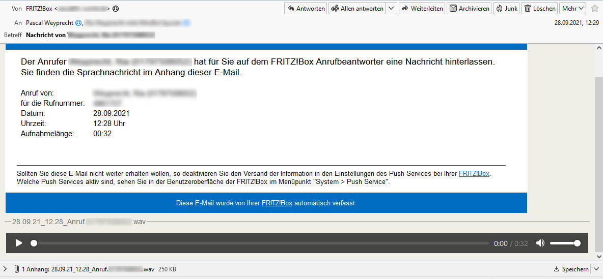

## Audio Preview

This Addon adds a preview for wave files in the message view, so it can be played directly.

### Installation

1. [Download AudioPreview from the official Thunderbird add-on page](https://addons.thunderbird.net/de/thunderbird/addon/audio-preview/)
2. [Installing an Add-on in Thunderbird](https://support.mozilla.org/en-US/kb/installing-addon-thunderbird)

### Issues

* audio/mpeg files like mp3s can not be played, because Thunderbird does not have a decoder for it.

### Screenshots

### 3rd Party

This project uses the following:

* [Lautsprecher Icons erstellt von Freepik - Flaticon](https://www.flaticon.com/de/kostenlose-icons/lautsprecher)

### License

[Mozilla Public License version 2.0](LICENSE.txt)